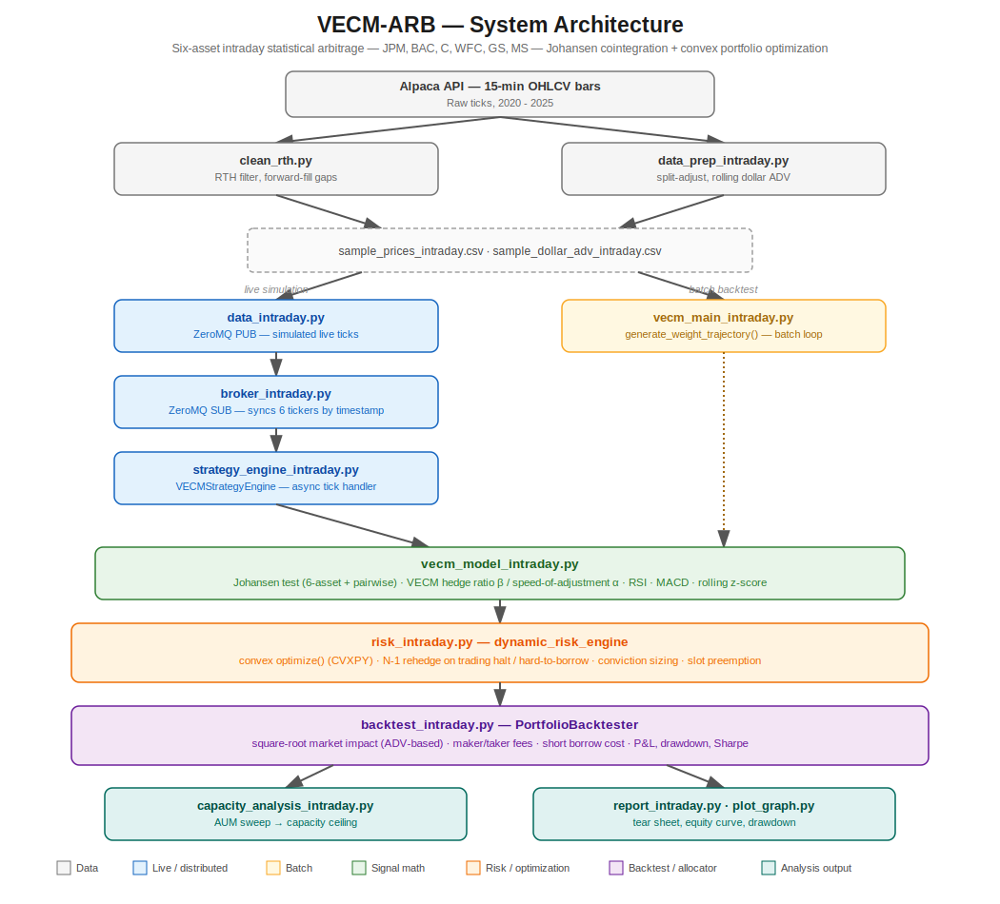

# VECM-ARB — Intraday Statistical Arbitrage Engine

A distributed, cointegration-driven statistical arbitrage system trading six U.S. bank stocks (`JPM`, `BAC`, `C`, `WFC`, `GS`, `MS`) on 15-minute bars. Built for the FEC IIT Guwahati DIY Project Compendium 2026 — Quant · Hard track.

The system identifies mean-reverting linear combinations of the six stocks via the Johansen procedure, sizes positions with mean-variance convex optimization rather than naive beta-weighting, and runs the same signal/risk core through both a batch backtester and a ZeroMQ-driven live simulation.

---

## Architecture



Data flows one of two ways after prep:

- **Live path** — `data_intraday.py` publishes simulated ticks over a ZeroMQ `PUB` socket; `broker_intraday.py` subscribes and synchronizes all six tickers by exact timestamp before handing a snapshot to `strategy_engine_intraday.py`.
- **Batch path** — `vecm_main_intraday.py` walks the full price history directly through the same decision logic via `generate_weight_trajectory()`, a generator that yields one weight-trajectory record per bar.

Both paths call into the same `vecm_model_intraday.py` (signal generation) and `risk_intraday.py` (position sizing) modules, so a signal fires identically whether it's being replayed in a backtest or streamed live — the two engines were kept in lockstep deliberately, after an earlier version of this project (semiconductor universe) drifted out of sync between its live and backtest lookback windows.

`capacity_analysis_intraday.py` reuses `generate_weight_trajectory()` — computed once — and replays the *same* trade sequence through `PortfolioBacktester` at different AUM levels, since position sizing here is expressed in weight-fractions of capital, not share counts, so the trade sequence itself doesn't change with AUM; only the cost of executing it does.

---

## Econometric Methodology

**Cointegration.** `vecm_model_intraday.py` runs the Johansen procedure (`statsmodels.tsa.vector_ar.vecm.coint_johansen`) on the full six-asset log-price system every `REFIT_INTERVAL` bars (once per trading day), extracting the cointegrating vector(s) as hedge ratios (β) directly from the eigenvectors. A pairwise fallback runs alongside it, since six correlated bank stocks sometimes cointegrate two at a time even when the full-rank system doesn't.

**Speed of mean reversion.** For each candidate spread, an AR(1) half-life is estimated from the same trailing window used for the Johansen fit. Signals with half-life above `max_entry_halflife` (120 bars ≈ 4.4 trading days) are discarded — a slow-reverting spread ties up capital and slot budget without paying for it in resolved trades.

**Entry/exit signal.** The spread's rolling z-score is the primary trigger (`entry_threshold = 1.7`, `exit_threshold = 0.3`), confirmed by MACD histogram sign (momentum must be turning against the z-score direction) and boosted by RSI when it's aligned. A `min_beta_confirmations` filter requires the same cointegrating relationship to have shown up in multiple recent refits before it's tradeable, to avoid acting on a one-off Johansen artifact.

**Position sizing.** Sizing is not naive beta-proportional. `risk_intraday.dynamic_risk_engine.optimize()` solves a mean-variance convex program (CVXPY) each bar — maximize `alpha @ w − gamma · w'Σw − turnover_penalty · ‖w − w_prev‖₁` subject to a gross-leverage cap and a per-asset weight cap, where Σ is the trailing sample covariance of the six assets. This is what lets the system size around correlation structure rather than trusting the Johansen beta vector at face value.

**Cointegration breakdown protocol.** On every refit, rank is re-tested for any asset currently held; `RANK_DROP_CONFIRMATIONS` consecutive zero-rank refits forces liquidation (`rank_dropped`). Independently, every bar checks whether the current spread value is a statistical outlier against its own trailing window (`check_cointegration_stability`); `COINT_STABILITY_CONFIRMATIONS` consecutive breaks forces liquidation (`cointegration_breakdown`). These are two different failure modes — a rank drop means the relationship stopped existing; a stability break means the relationship is still there but currently misbehaving — and they're tracked separately.

**Look-ahead discipline.** Every refit uses `log_prices[t-LOOKBACK : t]` — strictly excluding the current bar. The current bar's own close is used for the entry/exit z-score and for sizing (`log_prices[... : t+1]`), which is a same-bar decide-and-execute assumption, not look-ahead: nothing computed from bar `t` is applied to a return that occurred before `t`. PnL accounting in `backtest_intraday.py` always charges `w_prev` — the weight decided at the previous bar — against the return realized this bar; a weight decided at `t` only starts earning P&L from `t → t+1`.

---

## Distributed Systems Design

**Why pub/sub over point-to-point.** The live engine consumes market data as an independent stream from the strategy's decision loop, so a slow Johansen refit or a stalled CVXPY solve can't block the data feed from advancing. `broker_intraday.py` subscribes over ZeroMQ, buffers per-symbol until all six tickers for a timestamp have arrived, then emits one synchronized six-asset snapshot — this sync-by-full-timestamp (not by date) was a deliberate fix after an earlier version collapsed all of a day's intraday bars onto a single key.

**Dynamic risk & hedging — trading halts and hard-to-borrow.** There's no explicit halt flag in the data, but `data_prep_intraday.py` forward-fills any missing print, so a halted or untraded asset shows up as bit-for-bit identical consecutive closes — a real, checkable signal, not a synthetic one (the sample data has 19–39 such 2+-bar events per asset). `HALT_STALE_BARS` consecutive identical closes flags an asset as halted. Any active slot touching a halted asset gets rehedged before the normal exit checks run: `risk_intraday.optimize()` takes a `frozen_mask` / `frozen_values` pair that pins the halted asset's weight via an equality constraint while the convex solver reoptimizes the remaining N−1 assets' weights against it — recalculating the free legs to minimize risk against a position it can no longer trade. New entries and slot preemptions independently skip any signal whose beta touches a currently-halted asset. Hard-to-borrow cost is modeled continuously rather than as a binary flag: `_borrow_rates()` scales each asset's borrow rate by its own liquidity stress (ADV deviation from its trailing median) and volatility stress, so a stock that's getting expensive to borrow before a halt already carries that cost, not just after.

**Capital allocation across signals.** Two concurrent position slots (`NUM_SLOTS = 2`), each budgeted `SLOT_CAPITAL_FRAC = 0.5` of gross leverage. This was set empirically, not arbitrarily — an earlier multi-leg concurrent-trading variant that tried to run more simultaneous positions degraded performance, because the six bank stocks are highly cross-correlated (pairwise correlations ~0.73–0.86 in this sample), so additional "diversifying" slots were really just re-expressing the same systematic risk. A weaker open slot can be preempted by a materially stronger incoming signal (`should_preempt`, gated on both a z-score ratio and a minimum holding period, so a slot can't be evicted the bar after it opens).

---

## Microstructure-Aware Cost Model

`backtest_intraday.py`'s `PortfolioBacktester` charges three separate frictions every bar:

| Cost | Model | Note |
|---|---|---|
| Market impact | Square-root impact — `gamma · vol · sqrt(participation) · notional`, `participation = notional / ADV` | scales convexly, not linearly, with trade size relative to liquidity |
| Trading fees | `MAKER_TAKER_FEE = 0.0005` (5 bps) on notional traded, one-way | blended approximation of exchange taker fees at this price range |
| Borrow cost | Per-asset annualized short rate, stressed by liquidity and volatility (see above) | charged only against short exposure, every bar |

None of these are optional or togglable per-run — they're always in the accounting, which is why the tear sheet below is meaningfully lower than an earlier zero-fee version of this backtest.

---

## Repository Structure

| File | Role |
|---|---|
| `vecm_model_intraday.py` | Johansen test, VECM β/half-life extraction, RSI/MACD, rolling z-score |
| `risk_intraday.py` | `dynamic_risk_engine` — convex position sizing, halt-aware N−1 rehedging, conviction sizing, slot preemption |
| `backtest_intraday.py` | `PortfolioBacktester` — P&L accounting, market impact, fees, borrow cost, drawdown/Sharpe |
| `vecm_main_intraday.py` | Batch backtest entry point; `generate_weight_trajectory()` is the shared decision-loop generator |
| `strategy_engine_intraday.py` | `VECMStrategyEngine` — the live, tick-driven counterpart, same signal/risk core |
| `capacity_analysis_intraday.py` | AUM sweep against the fixed trade trajectory — finds where market impact erodes CAGR to zero |
| `broker_intraday.py` | ZeroMQ `SUB` — synchronizes six independent ticker streams by timestamp |
| `data_intraday.py` | ZeroMQ `PUB` — replays historical bars as a simulated live feed |
| `data_prep_intraday.py` | Split-adjustment, rolling dollar-ADV construction |
| `clean_rth.py` | Regular-trading-hours filter, forward-fill of data gaps |
| `report_intraday.py`, `plot_graph.py` | Tear sheet and position-visualization plotting |
| `run_publisher_intraday.py`, `run_strategy_intraday.py` | Process entry points for the live simulation |
| `sample_prices_intraday.csv`, `sample_dollar_adv_intraday.csv` | Checked-in, cleaned 15-min data for the six-asset universe, 2020–2025 — the backtest runs directly off these |

---

## Setup & Reproduction

```bash
pip install -r requirements.txt
```

**Reproducibility note:** the script that pulls raw bars from Alpaca isn't checked into this repo, since it needs API credentials — but `sample_prices_intraday.csv` and `sample_dollar_adv_intraday.csv` are, so the backtest runs out of the box without needing to regenerate them.

Run the backtest:

```bash
python3 vecm_main_intraday.py
```

Produces `backtest_intraday.csv` (per-bar P&L), `performance_metrics_intraday.csv` (tear sheet), and `exit_reasons_intraday.csv` (every entry/exit/rehedge event with its trigger reason).

Run the capacity sweep (reuses the same trade trajectory computed once, so it's a single extra pass of accounting, not a re-run of signal generation, per AUM level):

```bash
python3 capacity_analysis_intraday.py
```

Produces `capacity_analysis_intraday.csv` and a CAGR/Sharpe-vs-AUM plot, and prints the AUM at which CAGR crosses zero.

Run the live simulation (two separate processes, ZeroMQ pub/sub between them):

```bash
python3 run_publisher_intraday.py   # terminal 1
python3 run_strategy_intraday.py    # terminal 2
```

Visualize positions:

```bash
python3 plot_graph.py
```

---

## Performance

From the checked-in backtest run (2020–2025, six-asset universe, 15-minute bars, $1M starting capital):

| Metric | Value |
|---|---|
| Total bars | 38,991 |
| Ending capital | $1,640,289 |
| CAGR | 9.02% |
| Sharpe | 0.49 |
| Max drawdown | 17.94% |
| Annualized volatility | 10.5% |
| Avg. gross exposure | 28.1% |
| Avg. turnover / bar | 0.58% |
| Total trades | 353 |
| Total frictions (impact + fees + borrow) | $177,032 |

**Exit reason breakdown** (213 entries / 213 exits, plus 79 halt-driven rehedges that adjusted a position without fully closing it):

| Reason | Count |
|---|---|
| `rank_dropped` — Johansen rank hit 0, confirmed | 99 |
| `z_decay` — spread reverted, normal exit | 87 |
| `cointegration_breakdown` — spread stability check failed | 22 |
| `preempted` — evicted by a stronger signal | 5 |

The dominant constraint on this strategy is signal scarcity, not exit logic or sizing — average gross exposure sits at 28%, meaning the book is flat roughly three-quarters of the time. Widening `entry_threshold` or adding slots increases trade count but degrades risk-adjusted returns, because the six-asset universe is too internally correlated (pairwise correlation 0.73–0.86) to support genuinely independent concurrent positions — this was tested and reverted, not assumed.

## Capacity

Run `python3 capacity_analysis_intraday.py` to populate `capacity_analysis_intraday.csv` — it sweeps AUM from $1M to $10B against the fixed trade trajectory above and reports the level at which market impact erodes CAGR to zero.
